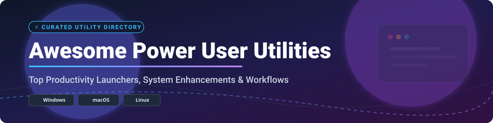

# ⚡ Awesome Power User Utilities 🛠️

> 🚀 A curated directory of top **power user utilities**, **productivity launchers**, **desktop automation software**, **window managers**, **clipboard managers**, and **system enhancement tools** across Windows 🪟, macOS 🍏, and Linux 🐧.

---

## 📌 Table of Contents

- [💡 Overview & Market Insights](#-overview--market-insights)
- [💳 SaaS & Commercial Products](#-saas--commercial-products)
- [🌐 Open-Source GitHub Projects](#-open-source-github-projects)
- [🛠️ Recommended Open-Source Power Stacks](#️-recommended-open-source-power-stacks)
- [🤝 How to Contribute](#-how-to-contribute)
- [💖 Support & Sponsorship](#-support--sponsorship)
- [⭐ Star History](#-star-history)
- [⚠️ Disclaimer](#️-disclaimer)

---

## 💡 Overview & Market Insights

The global desktop power user and system utility software market is estimated at **$12.5 Billion+ (2026)**, spanning specialized productivity launchers, screen capture engines, window management tools, and desktop automation software. 

**Market Dynamics:** The sector is **highly fragmented**, characterized by niche boutique developers (e.g., Running with Crayons, folivora.ai), self-funded indie products (CleanShot X, Magnet), and venture-backed category disrupters (Raycast). While OS tech giants like Microsoft (PowerToys) and Apple bundle baseline system capabilities, power users consistently adopt specialized third-party tools due to superior workflow customization, deep keyboard-driven interfaces, and rich plugin ecosystems. 📈

---

## 💳 SaaS & Commercial Products

Below is a curated comparison of leading commercial and freemium desktop power user utilities, sorted by **Company Size / Valuation / Capitalization (Descending)**. 🏆

| Rank | Product / Platform | Category | Target OS | Starting Pricing | Free Tier / Trial Limits | Company Size / Revenue / Valuation |
| :---: | :--- | :--- | :---: | :--- | :--- | :--- |
| **1** | **[Microsoft PowerToys](https://apps.microsoft.com/detail/9mwc2l3kq4sk)** / **[QuickLook](https://apps.microsoft.com/detail/9nv4bs3l1h4s)** | System Utility Suite / Quick Preview | Windows 🪟 | **$0.00** (Included with Windows / Store) | **Unlimited Free Access** (100% Free full features, no ads) | **$3.85 Trillion Market Cap** ($318B+ TTM Revenue) |
| **2** | **[Raycast](https://www.raycast.com/)** | Command Launcher & AI Assistant | macOS 🍏 | **$8.00 / mo** (Billed annually for Pro) | **Free Forever Tier** (Core launcher, extension store, unlimited local commands; AI & Cloud Sync require Pro) | **$48 Million Funding** (Series B, backed by Accel & YC) |
| **3** | **[Alfred](https://www.alfredapp.com/)** | Keyboard Launcher & Workflows | macOS 🍏 | **£34.00 single user** (~$44 one-time Powerpack) | **Free Forever Tier** (Basic search & app launching; Workflows, Clipboard History & Themes require Powerpack) | **Privately Held / Bootstrapped** (~$1M–$5M estimated annual sales) |
| **4** | **[CleanShot X](https://cleanshot.com/)** | Screen Capture & Cloud Sharing | macOS 🍏 | **$29.00 one-time** (Includes 1 yr updates + 1GB Cloud) | **30-Day Money-Back Trial** (No perpetual free plan; full features during evaluation) | **Privately Held Indie Developer** (Self-funded niche leader) |
| **5** | **[BetterTouchTool](https://folivora.ai/)** | Input Gestures & Window Snapping | macOS 🍏 | **$10.00 standard** (Includes 2 yrs updates) | **45-Day Full-Featured Free Trial** (No perpetual free tier; unrestricted evaluation for 45 days) | **Privately Held / Bootstrapped** (Independent developer folivora.ai) |
| **6** | **[Dropzone 4](https://aptonic.com/)** | Drag & Drop Actions / Shortcuts | macOS 🍏 | **$1.99 / mo** (Pro Subscription or $35 lifetime) | **Free Base Tier** (Standard grid & file actions; Pro actions have 14-day free trial) | **Privately Held / Bootstrapped** (Independent developer Aptonic) |
| **7** | **[Magnet](https://magnet.crowdcafe.com/)** | Window Manager & Snapping | macOS 🍏 | **$9.99 one-time** (Mac App Store purchase) | **No Free Tier / No Free Trial** (Paid download only on Mac App Store) | **Privately Held / Bootstrapped** (Independent developer CrowdCafe) |

---

## 🌐 Open-Source GitHub Projects

Top open-source productivity utilities and desktop enhancements, sorted by **GitHub Stars_Count (Descending)**. ⭐

| Rank | Project Name | Category | Primary OS | GitHub_Stars_Badge | License | Description & Key Features |
| :---: | :--- | :--- | :---: | :---: | :---: | :--- |
| **1** | **[Microsoft PowerToys](https://github.com/microsoft/PowerToys)** | System Suite | Windows 🪟 |  | MIT | **The ultimate Windows utility toolkit.** Includes FancyZones window manager, PowerToys Run launcher, Color Picker, PowerRename, File Locksmith, and Keyboard Manager. |
| **2** | **[ShareX](https://github.com/ShareX/ShareX)** | Screen Capture | Windows 🪟 |  | GPL-3.0 | **Feature-packed screen capture suite.** Screenshot, video/GIF recording, scrolling capture, OCR, image annotation, and 80+ automated upload destinations. |
| **3** | **[Rectangle](https://github.com/rxhanson/Rectangle)** | Window Manager | macOS 🍏 |  | MIT | **Essential macOS window manager.** Move and resize windows using keyboard shortcuts or snap areas. Ideal lightweight Magnet open-source replacement. |
| **4** | **[yabai](https://github.com/koekeishiya/yabai)** | Window Manager | macOS 🍏 |  | MIT | **Tiling window manager for macOS.** Automatically modifies window layout using binary space partitioning (BSP) and command-line control scripts. |
| **5** | **[Wox](https://github.com/Wox-launcher/Wox)** | Launcher | Windows 🪟 |  | MIT | **Full-featured Windows launcher.** Instantly search files, apps, and web bookmark content with a customizable plugin ecosystem. |
| **6** | **[Maccy](https://github.com/p0deje/Maccy)** | Clipboard | macOS 🍏 |  | MIT | **Lightweight macOS clipboard manager.** Fast, search-as-you-type history retention designed to keep your hands on the keyboard. |
| **7** | **[Quick Look Plugins](https://github.com/sindresorhus/quick-look-plugins)** | Preview Enhancer | macOS 🍏 |  | MIT | **Curated list of macOS Quick Look plugins.** Preview syntax-highlighted code, JSON, Markdown, rendering ZIP archives, and images instantly. |
| **8** | **[Ulauncher](https://github.com/Ulauncher/Ulauncher)** | Launcher | Linux 🐧 |  | GPL-3.0 | **Application launcher for Linux.** Minimal GTK+ launcher featuring fuzzy search, extensions, custom themes, and shortcut commands. |
| **9** | **[AltTab](https://github.com/lwouis/alt-tab-macos)** | Window Switcher | macOS 🍏 |  | GPL-3.0 | **Brings Windows Alt-Tab window switcher power to macOS.** View live window previews, minimize/close apps, and filter windows across monitors. |
| **10** | **[Amethyst](https://github.com/ianyh/Amethyst)** | Window Manager | macOS 🍏 |  | MIT | **Automatic tiling window manager for macOS.** Written in Swift, inspired by xmonad with dynamic layouts and keyboard shortcuts. |
| **11** | **[Flow Launcher](https://github.com/Flow-Launcher/Flow.Launcher)** | Launcher | Windows 🪟 |  | MIT | **Modern productivity launcher for Windows.** Instant file search via Everything integration, environment commands, and Python/C# plugins. |
| **12** | **[Espanso](https://github.com/espanso/espanso)** | Text Expander | Cross-platform 💻 |  | GPL-3.0 | **Cross-platform text expander written in Rust.** Detects typed triggers and replaces them with snippets, shell script outputs, or dynamic dates. |
| **13** | **[AutoHotkey](https://github.com/AutoHotkey/AutoHotkey)** | Automation | Windows 🪟 |  | GPL-2.0 | **Windows automation scripting engine.** Automate hotkeys, remap keys, define hotstrings, and script desktop GUI macros. |
| **14** | **[GlazeWM](https://github.com/glzr-io/glazewm)** | Window Manager | Windows 🪟 |  | GPL-3.0 | **Tiling window manager for Windows.** Inspired by i3 and bspwm; offers customizable workspaces, keybindings, and multi-monitor support. |
| **15** | **[CopyQ](https://github.com/hluk/CopyQ)** | Clipboard | Cross-platform 💻 |  | GPL-3.0 | **Advanced clipboard manager with editing and scripting.** Store searchable text, images, and HTML with customizable tab categories. |
| **16** | **[ueli](https://github.com/oliverschwendener/ueli)** | Launcher | Cross-platform 💻 |  | MIT | **Keystroke launcher for Windows and macOS.** Built with Electron for quick app starting, bookmark navigation, and terminal execution. |
| **17** | **[Cerebro](https://github.com/cerebroapp/cerebro)** | Launcher | Cross-platform 💻 |  | MIT | **Extensible open-source desktop launcher.** Open files, search web engines, convert currency, and execute system commands. |
| **18** | **[Ditto](https://github.com/sabrogden/Ditto)** | Clipboard | Windows 🪟 |  | GPL-3.0 | **Classic Windows clipboard extension.** Saves all copied items (text, images, files) into an encrypted database with network sync. |
| **19** | **[Kando](https://github.com/kando-menu/kando)** | Radial Menu | Cross-platform 💻 |  | GPL-3.0 | **Pie menu launcher for mouse and touch.** Trigger radial context menus for app shortcuts, key combos, and desktop workflows. |
| **20** | **[Albert](https://github.com/albertlauncher/albert)** | Launcher | Linux 🐧 |  | C++ License | **Desktop agnostic launcher for Linux.** Written in C++ for maximum speed; indexes files, applications, bookmarks, and terminal commands. |
| **21** | **[AutoKey](https://github.com/autokey/autokey)** | Automation | Linux 🐧 |  | GPL-3.0 | **Desktop automation utility for Linux.** Provides text expansion and keyboard macro automation using Python scripts. |
| **22** | **[Keypirinha](https://github.com/Keypirinha/Keypirinha)** | Launcher | Windows 🪟 |  | Freeware Source | **Fast, keyboard-driven launcher for Windows.** Ultra-fast execution, low memory overhead, and Python-driven plugin engine. |

---

## 🛠️ Recommended Open-Source Power Stacks

Build a zero-cost power user setup tailored to your operating system:

### 🪟 Windows Power Stack
- **Launcher**: [Flow Launcher](https://github.com/Flow-Launcher/Flow.Launcher) + Everything Search plugin 🚀
- **System Suite & Window Snapping**: [Microsoft PowerToys](https://github.com/microsoft/PowerToys) (FancyZones) or [GlazeWM](https://github.com/glzr-io/glazewm) for tiling 🪟
- **Screen Capture & OCR**: [ShareX](https://github.com/ShareX/ShareX) 📸
- **Macro Automation**: [AutoHotkey](https://github.com/AutoHotkey/AutoHotkey) ⚡
- **Clipboard Management**: [CopyQ](https://github.com/hluk/CopyQ) or [Ditto](https://github.com/sabrogden/Ditto) 📋

### 🍏 macOS Power Stack
- **Window Management**: [Rectangle](https://github.com/rxhanson/Rectangle) or [yabai](https://github.com/koekeishiya/yabai) 📐
- **Window Switching**: [AltTab](https://github.com/lwouis/alt-tab-macos) 🔄
- **Clipboard History**: [Maccy](https://github.com/p0deje/Maccy) 📋
- **Text Expansion**: [Espanso](https://github.com/espanso/espanso) ✍️
- **Quick Look Extensions**: [Quick Look Plugins](https://github.com/sindresorhus/quick-look-plugins) 👁️

### 🐧 Linux Power Stack
- **Application Launcher**: [Ulauncher](https://github.com/Ulauncher/Ulauncher) or [Albert](https://github.com/albertlauncher/albert) 🚀
- **Desktop Automation & Expansion**: [AutoKey](https://github.com/autokey/autokey) or [Espanso](https://github.com/espanso/espanso) ⚡
- **Clipboard Manager**: [CopyQ](https://github.com/hluk/CopyQ) 📋

---

## 🤝 How to Contribute

1. Fork this repository 🍴.
2. Add or update tool listings in `README.md` following the tabular format.
3. Ensure accurate metrics (GitHub link, license, category, target OS, pricing detail).
4. Submit a Pull Request with a clear summary of your updates 🚀.

---

## 💖 Support & Sponsorship

If you found this repository useful, please consider supporting the project:

- ⭐ **Star** this repository on GitHub to increase its visibility.
- 🍴 **Fork** it to contribute improvements or maintain your own workflow list.
- 📢 **Share** it with fellow power users, developers, and productivity enthusiasts!
- ☕ **Buy me a coffee**: Support ongoing maintenance on the [Sponsor Dashboard](https://github.com/sponsors/ishandutta2007).

Thank you for your support! ❤️

---

## ⭐ Star History

---

## ⚠️ Disclaimer

- This directory is community-curated for informational purposes.
- System-level utilities require elevated permissions — evaluate security implications before installing third-party keyboard hooks or clipboard managers.
- Open-source project Stars_Counts and SaaS pricing tiers are updated periodically.

---

*Maintained with ❤️ for power users, software engineers, and workflow enthusiasts.*
